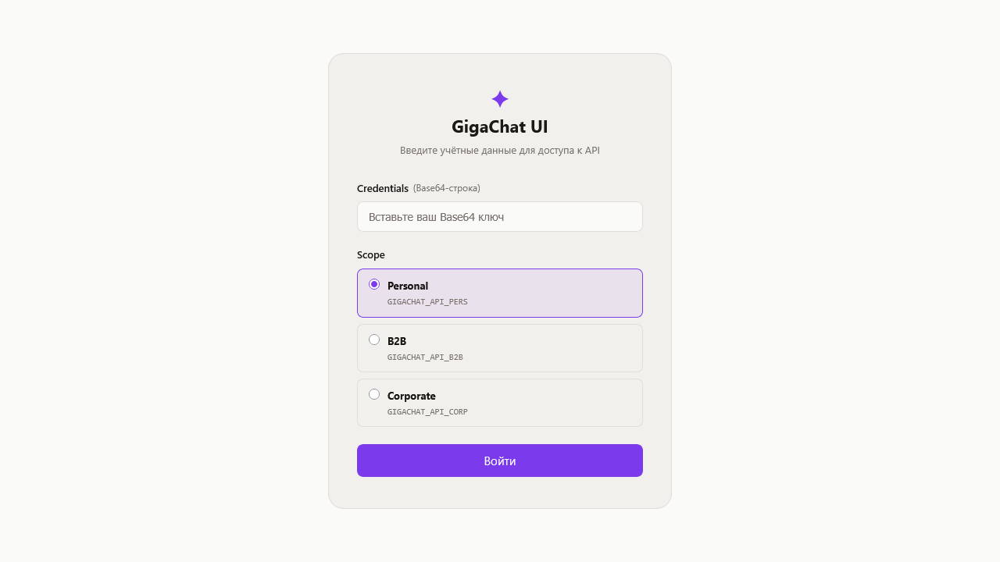
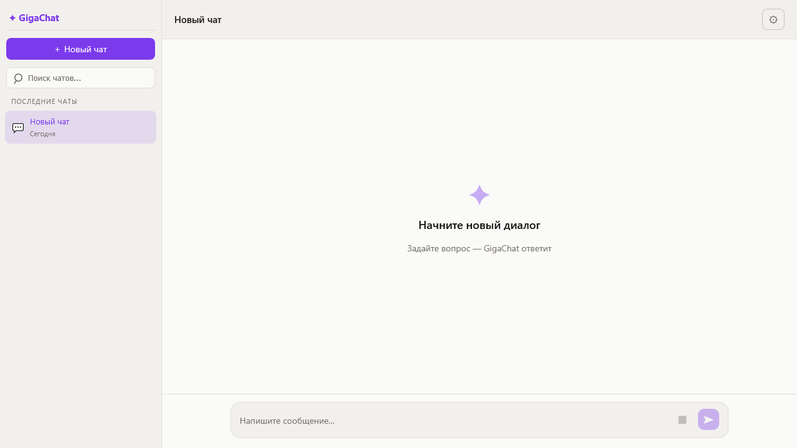
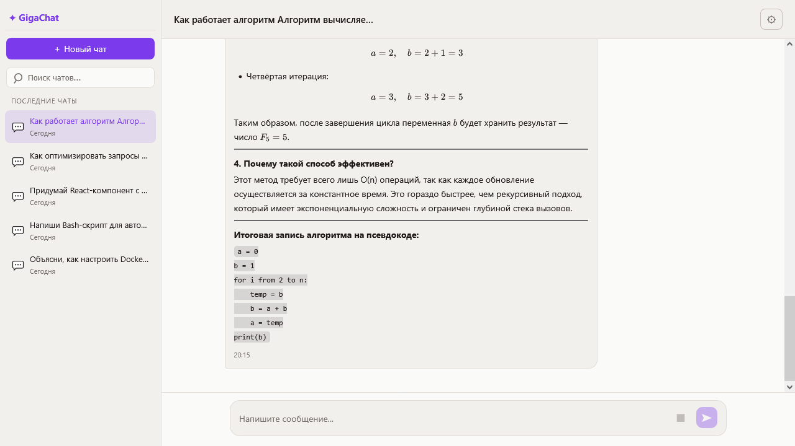
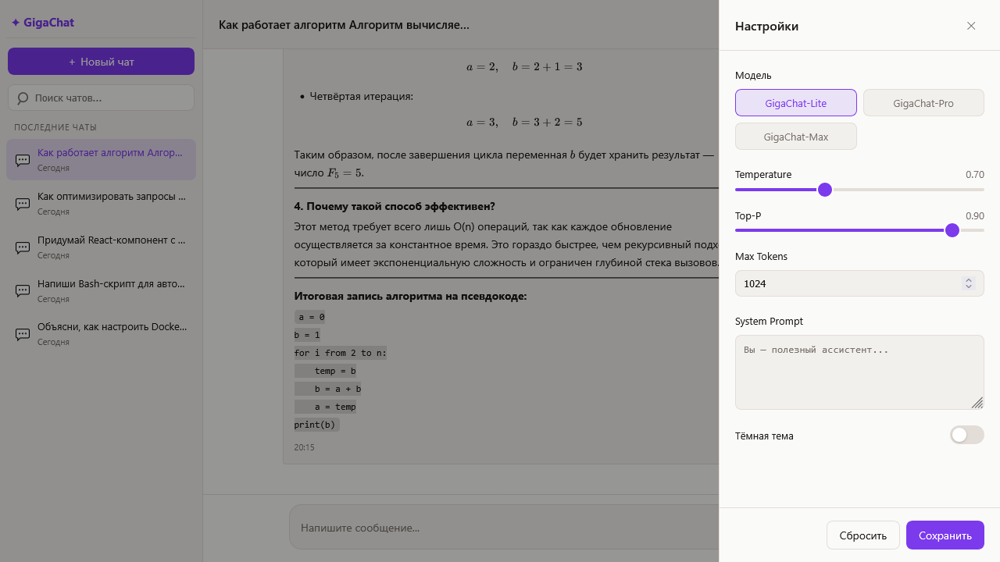

# GigaChat UI

Веб-интерфейс для диалога с нейросетью GigaChat — аналог ChatGPT, реализованный на React + TypeScript.

## Демо

**Развёрнутое приложение:** https://egorstepanovcl.github.io/mipt-gigachat-ui/

> Для работы необходим Base64-ключ авторизации GigaChat API (Client ID + Client Secret, закодированные в Base64), а также развёрнутый прокси из директории [`proxy/`](proxy/).

### Скриншоты

| Экран авторизации | Чат с ассистентом |
|---|---|
|  |  |

| Боковая панель | Панель настроек |
|---|---|
|  |  |

## Стек технологий

| Категория | Инструмент | Версия |
|---|---|---|
| Фреймворк | React | 19.2 |
| Язык | TypeScript | 5.9 |
| Сборщик | Vite | 7.3 |
| Маршрутизация | React Router DOM | 7.13 |
| State management | Context API + useReducer | — |
| Стили | CSS Modules | — |
| Markdown | react-markdown | 10.1 |
| Подсветка кода | react-syntax-highlighter (Prism) | 16.1 |
| Формулы (LaTeX) | remark-math + rehype-katex | 6.0 / 7.0 |
| Тесты | Vitest + React Testing Library | 4.1 / 16.3 |
| Деплой | GitHub Pages + GitHub Actions | — |

## Запуск локально

### Предварительные требования

- Node.js 20.19+ или 22.12+
- npm ≥ 9
- Ключ авторизации GigaChat API (Base64-строка)

### Установка и запуск

```bash
# 1. Клонировать репозиторий
git clone https://github.com/egorstepanovcl/mipt-gigachat-ui.git
cd mipt-gigachat-ui

# 2. Установить зависимости
npm install

# 3. Запустить dev-сервер
npm run dev
```

Приложение откроется по адресу http://localhost:5173/mipt-gigachat-ui/

На экране авторизации вставьте Base64-ключ в поле **Credentials** и нажмите **Войти**.

### Запуск тестов

```bash
npm test            # Запуск всех тестов (watch-режим)
npm test -- --run   # Однократный прогон без watch-режима
```

Тесты покрывают: reducer (`chatReducer.test.ts`), компоненты (`ChatInput`, `Message`, `Sidebar`), персистентность (`storage.test.ts`).

## Архитектура проекта

```
src/
├── api/            # API-адаптер GigaChat
├── app/
│   ├── providers/  # ChatProvider, SettingsProvider (Context API + useReducer)
│   └── router/     # Маршруты React Router
├── components/
│   ├── auth/       # Форма авторизации
│   ├── chat/       # ChatWindow, MessageList, Message, ChatInput, TypingIndicator
│   ├── layout/     # AppLayout
│   ├── settings/   # SettingsPanel
│   ├── sidebar/    # Sidebar, ChatList, ChatItem, SearchInput
│   └── ui/         # Переиспользуемые атомы: Button, Toggle, Slider, ErrorMessage
├── hooks/          # useChat, useStreamingResponse
├── store/          # chatReducer + defaultState
├── types/          # TypeScript-типы (Message, Chat, ChatState, Settings)
└── utils/          # storage.ts (localStorage persistence)
```
